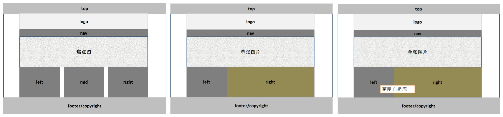

# 1. 清除默认样式 

```css
*{
margin:0; 
padding:0; 
font-size:12px;
} 
```
# 2. body的背景 
```body{background-color:??;} ```

# 3. 头部（top） 
* 1.1 宽度铺满屏幕 ```.top{width:100%;} ```
* 1.2 内容居中显示 ```css{width:??px; margin:0 auto;} ```
* 1.3 设为首页and加入收藏: 用JavaScript实现 

# 4. logo区 

设置.wrap包裹内容，以实现内容定宽居中 

# 5. 导航（nav）区 
一般用：有序/无序列表 实现导航菜单；form实现搜索框。 

# 5.1 有序/无序列表制作导航菜单 
```html
<ul> 
<li><a href="#">首页</a> 
<li><a href="#">首页</a> 
<li><a href="#">首页</a> 
<li><a href="#">首页</a> 
</ul> 
```
* ①利用```li{float:left/right;}```使各个<li>处于同一行 
* ②利用```li{list-style-type：none;}```去除小圆点 
* ③设置```li{width:?px;}```使各个<li>间距相等 
* ④利用```li{height:?px;}```使<li>中的文字垂直居中（行高等于div高） 

# 5.2 form实现搜索框

```html
<form action="" method="post">
  <input type="text" class="search_text"/>
</form>
```

* ①设置```input{margin-top:?px;}```使搜索框在导航条内居中 
* ②搜索框内的放大镜小图标：利用背景图片来设置 ```input{background:url(?) no-repeat right center;}```
等价于

```css
input{
background-image:url(?);
background-repeat:no-repeat;
background-position:right center;
}
```

* ③防止搜索框中输入的文字遮挡上述小图标：设置内边距等于图表宽度 
``` input{padding-right:?px} ```

# 6. 焦点图的制作(myFocus) 

6.1 使用时拷贝myFocus Demo v2.0.1/js整个文件夹到站点中 

6.2 在html的标签内引入相关文件

```html
<!--引入myFocus库文件--><script src="js/myfocus-2.0.1.min.js" type="text/javascript"></script> 
<!--引入所使用的风格js文件--><script src="js/mf-pattern/mF_YSlider.js" type="text/javascript"></script> 
<!--引入所使用的风格css文件--><link href="js/mf-pattern/mF_YSlider.css" rel="stylesheet" type="text/css"/>
```

6.3 创建myFocus标准的html结构，并填充内容
```html
<div class="ad" id="picBox">
  <div class="loading"></div>
  <div class="pic">
      <ul>
      <li></li>
      <li></li>
      <li></li>
      </ul>
  </div>
```
注意： 
* ①焦点图初始化的ID必须与图片列表最外层id一致 
* ②图片列表外面必须包裹一个 class="pic" 的 div 
* ③上述```class="ad"```的div需要设置样式： 
```.ad{height:?px;/?等于图片高度/ overflow:hidden;/使超出div部分的被隐藏/}--> ```

## 7. 三列布局/两列布局 

* ①先设置父div的宽度； 
* ②分别设置各列的宽度，高度一般只设置min-height 
* ③设置各列的float 
* ④利用margin设置各列的间距

#7.1 三列布局
```css
.left{width:340px; }
.mid{width:410px; margin:0 7px;}
.right{width:230px;}
.left,.mid,.right{float:left;}
```
#7.2 两列布局
```css
.content{height:350px; margin-top:10px;}

.content_left{width:220px; /*height:350px;*/ /*不应该设置固定高度*/ min-height:350px; _height:350px; /* For IE6*/  float:left;}

.content_right{width:770px; /*height:350px;*/  /*不应该设置固定高度*/min-height:350px; _height:350px;  /* For IE6*/  float:right;}
```

# 8. 新闻列表的页码/解决新闻列表的时间在IE中的错位 
* 8.1 解决新闻列表的时间在IE中的错位： 将日期放在新闻标题的前面，就可以解决 
* 8.2 新闻列表的页码

```css
.page{height:40px; margin-top:10px; text-align:center;}
.page a{display:inline-block; /*将a设置为既能在同一行显示，又能设置宽度 高度等*/ border:1px solid #E8E8E8; text-decoration:none; margin:5px; padding:5px 10px;}
.page a:link,.page a:visited{color:#000;}
.page a:hover,.page a:active{color:#FFF;background-color:#CC1B1B;}
```

# 9. 插入优酷视频 

* ①找到优酷视频下方“分享给好友”下拉菜单中的html代码 
* ②复制-粘贴，稍微修改width和height 

# 10. 底部版权区footer/copyright 

* ①使用嵌套的有序/无序列表

```html
<ul>
<li><a href="#">关于</a>
  <ul>
  <li><a href="#">品牌故事</a>
  <li><a href="#">联系我们</a>
  </ul>
</li>
<li><a href="#">留言</a>
  <ul>
  <li><a href="#">新浪微博</a>
  <li><a href="#">腾讯微博</a>
  </ul>
</li>
</ul>
```

* ② 设置li的宽度来实现上述列表分组（如div宽度为1000px时，设置li宽度为200px，则可以分为5组） 

# 11. 文字/链接/图片的常用格式 

* ①文字格式：

```html
{text-align:center;}<!--设置文字水平居中-->
{line-height:?px;}<!--设置文字垂直居中 行高等于盒子高-->
img{vertical-align:middle;}<!--使文字旁的图片与文字对齐-->
```
* ②链接格式：

```css
a{text-decoration:none;}<!--去除链接的默认样式-->
a:link,a:visited{}
a:hover,a:active{}
a:focus{}
a{display:inline-block;background-color:red;}<!--使a的整行背景色改变-->
```
